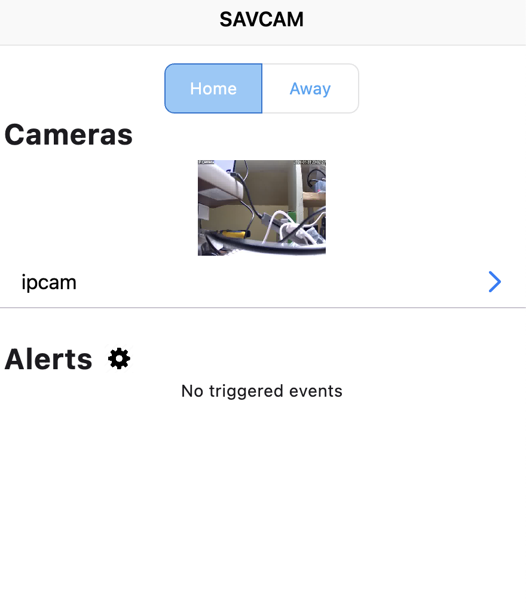

# SAVCAM (Smart AI Viam Camera) Flutter App

This app uses Viam's Flutter SDK to control a camera set up as a security camera, leveraging the Viam Computer Vision service, allowing for configurable rules that leverage any configured detectors or classifiers (for example, machine learning).

## Setup

### Hardware and Viam configuration

For hardware, any number of cameras (at least one) compatible with Viam are required.
We have tested with an RTSP camera as well as a USB webcam, but any should work.
You will also need a computer running 64 bit linux or MacOS.
We have tested with a Mac laptop and a Raspberry Pi.

Go to [the Viam App](https://app.viam.com) and configure a new machine.  Follow setup instructions, then go to the Config tab in the Viam app.
Set up a camera component of the model you will be using.  Our RTSP camera was set up with model 'ffmpeg' with this configuration (note, we use a fairly low resolution to reduce processing requirements):

```json
{
  "filters": [
    {
      "name": "scale",
      "args": [
        "640:480"
      ]
    }
  ],
  "video_path": "rtsp://10.0.0.29/1"
}
```

Next, in the Services section of the Config tab, you'll likely want to configure one or more Vision Services.
This could be an ML Model-based classifier or detector, or a pre-packaged vision service from the Viam registry like a [facial detector](https://app.viam.com/module/viam-labs/facial-detector) or [motion detector](https://app.viam.com/module/viam/motion-detector).

Once configured, these Vision Services will be available for use by the SAVCAM event manager, which you will not configure from the Components tab (choose event-manager from the 'Create component' menu).
You can leave the configuration attributes empty, but choose any Vision Services you may want to use as resources your event-manager "Depends on".
Save this configuration.

Finally, you'll need a replay camera of type 'image-dir', so select and configure that from the 'Create component menu', and save.
This will allow you to play image loops of any triggered security events that you configure.

### API Keys and mobile app configuration

This example app requires the use of API Keys. You can obtain an API Key by following the [documentation](https://docs.viam.com/manage/cli/#create-an-organization-api-key).
You will also need your configured robot location, part id, and the name of the event-manager and image-dir camera you configured.

Hardcode your API Key and other robot information into a `.env` file, should look like:

```
API_KEY_ID=<API KEY ID>
API_KEY=<API KEY>
ROBOT_LOCATION=<ROBOT LOCATION>
EVENT_MANAGER=<EVENT MANAGER COMPONENT NAME>
DIR_CAM=<IMAGE-DIR COMPONENT NAME>
PART_ID=<PART ID>
```

### Permissions

On many operating systems, apps are not granted access to the internet by default. To update these permissions, follow the steps below for whichever operating system you are targeting.

**Android**

Android apps must declare their use of the internet in the Android manifest (`android/app/src/main/AndroidManifest.xml`):

```xml
<manifest xmlns:android...>
 ...
 <uses-permission android:name="android.permission.INTERNET" />
 <application ...
</manifest>
```

**macOS**

macOS apps must allow network access in the relevant `.entitlements` files (`macos/Runner/{DebugProfile | Release}.entitlements`).

```xml
<key>com.apple.security.network.client</key>
<true/>
```

## Run

To run the app, you should run the `lib/main.dart` file:

```sh
flutter run -d macos lib/main.dart
```

## Screenshots

- [**Home Screen**](https://github.com/viam-labs/SAVCAM-app/tree/main/lib/main.dart): Main screen, where you will see a preview of any configured cameras and any triggered alerts.
  